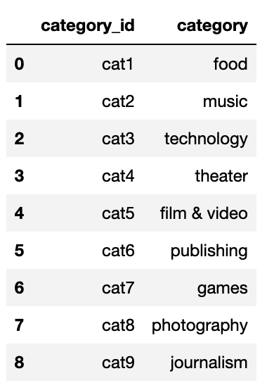

# Crowdfunding ETL Mini-Project
Building an ETL pipeline using Python and Pandas to extract and transform data and PostgreSQL with pgAdmin to load  

- - -
## Project Structure

- Original source data (Excel files) can be found in the [Resources](Resources/) folder, along w/images used in this README.  
- All project deliverables can be found in the [Project_Files](Project_Files/) folder.  
- All CSV output files generated from the transformations can be found in the [Output](Output/) folder.

### Deliverable 1:
**Jupyter Notebook - Extract/Transform:** [Crowdfunding_ETL.ipynb](Project_Files/Crowdfunding_ETL.ipynb)  
### Deliverable 2:
**Entity Relationship Diagram:** [Crowdfunding_ERD.png](Project_Files/Crowdfunding_ERD.png)  
### Deliverable 3:
**Database Schema - Load:** [crowdfunding_db_schema.sql](Project_Files/crowdfunding_db_schema.sql)  
- - -

## Deliverable 1:

A Jupyter Notebook file to extract and transform Excel data to create four separate cleaned DataFrames as shown below, and then export them to CSV files.
#### Campaign:
  
#### Campaign Category:
  
#### Campaign Subcategory:
  
#### Contact Information:
  

- - -
## Deliverable 2:
An Entity Relationship Diagram visualization of the cleaned tables & their relationships:  
 

- - -

## Deliverable 3:

A SQL schema file that does the following:
 - Creates a database in pgAdmin using PostgreSQL
 - Creates tables for the above CSV files
 - Runs some test queries to verify the tables were imported correctly

### Instructions for Use
 To run this file, please follow these steps:  
 1. Run the code in "SECTION ONE" in pgAdmin to create the database.
 2. Open a new Query Tool in the new database & run the code in "SECTION TWO" to create the tables.
 3. Refresh the database.
 4. Import each table in the order they were created with the default settings.
 5. Run each query statement in "SECTION THREE" to verify the tables were imported correctly. You should see results similar to those in the image below on the last query.

- - -

## References
Data for this dataset was generated by edX Boot Camps LLC, and is intended for educational purposes only.
